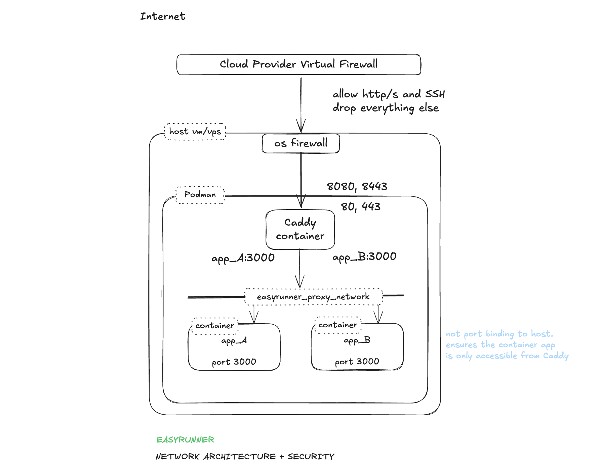

Every aspect of EasyRunner is designed with security in mind. While it's impossible for anybody to guarantee of being 100% secure, making security a first class design requirement goes a long way to significantly reducing the risk. A web host server has multiple vectors that needs to be secured. Here's how networking of a host server get's configured with network security in mind.
<!-- more -->

The goal with the network setup is to reduce the surface area to a minimum. We explicitly only allow what's needed. Drop everything else by default. We generally follow the defense in depth principle.

## OS Firewall

- Implemented using IPTables.
- Default drop all policy
- Explicit allow 80, 443, 22
- 80 and 443 port redirects to reverse proxy that listing on 8080 and 8443.
- Only allow established connections to 8080 and 8443 i.e. externally port forward traffic. Local traffic is blocked.
- Port 2019 traffic restricted to just localhost. Explicit block rule for external traffic (defense in depth)

## Caddy Reverse Proxy

- Runs in a container in the context of it's own OS user account
- Bind to all host network interfaces on ports 8080, 8443 (maintain high ports only binding in rootless mode)
- Bind to host localhost on port 2019 (Caddy Admin API)
- Configured to always redirect HTTP -> HTTPS (ensures HTTPS always)
- TLS certificated are automatically setup for every application with certs issued by [Let's Encrypt](https://letsencrypt.org/).
- Minimise information leaking that can be used by bad actors to identify vulnerable system. For example: remove X-Powered header.

## App Containers

- Containers in each app stack run in the context of a dedicated OS user account. One per stack.
- Containers do NOT bind to host ports. Therefore only accessible on the proxy network.
