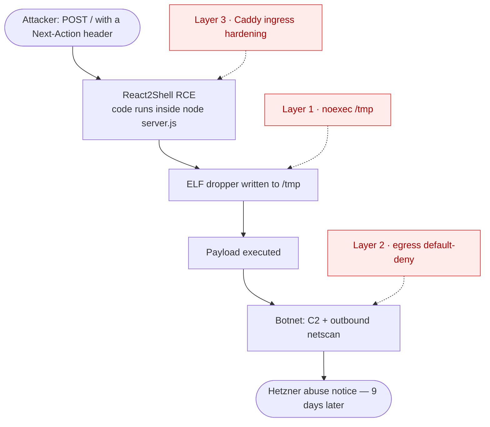

A Hetzner abuse email is not how you want to learn that one of your own apps has joined a botnet.

> We have indications that there was an attack from your server.

That was the gist of it — one flat sentence from Hetzner's abuse desk, the polite version of *something on your box is attacking other machines*. The culprit turned out to be a small personal Next.js app — a private search engine over my own notes and documents — that I'd deployed months earlier and mostly forgotten about, popped by a critical Next.js RCE and quietly scanning the internet for **nine days** before an outside party noticed.

This post is the whole account — the alert, tracking down *which* app it was, patching and rotating and redeploying it. But the part I actually care about is the last bit: what's now going into EasyRunner so that the next time a hosted app gets breached, it can't take the whole server down with it. Because it will happen again. To someone. Maybe to you.

<!-- more -->

## :material-email-alert: It wasn't an alert of mine that caught it

The uncomfortable truth first: nothing I ran caught this. An external abuse desk did. The compromise landed on **23 June**; the Hetzner notice arrived on **2 July**. Nine days of my container acting as a scanner and phoning home to a command-and-control server, and the first signal came from someone else's inbox.

That gap is a finding in its own right, and it comes back later as an entire layer of the response. But first I had to work out what on earth was happening.

One thing I was confident about from the start: it wasn't the *host* that had been breached. The server's own attack surface is deliberately tiny — only `:80` and `:443` are exposed to the public internet, and SSH is locked down to the EasyRunner Mesh VPN, so the only machine that can open a shell on it is my laptop. If traffic was attacking the outside world from my box, it was almost certainly coming from *inside* an app. And because that server hosts several web apps, the question became: *which* one?

## :material-magnify: Which app? Running the RCA with Claude Code over the `er` CLI

My first instinct was wrong, and it's worth owning: I assumed a **supply-chain compromise** in `shoutrrr`, a notification-relay service I'd added to that box only recently — that felt far likelier than one of my older, boring apps suddenly turning malicious. So the brief I gave Claude Code was deliberately narrow: *investigate, find the cause, **don't change anything*** — read-only, preserve the evidence.

Here's where EasyRunner earned its keep the first time. I didn't hand it an SSH-as-root shell — I pointed **Claude Code** at the box and let it drive the same `er` CLI I use. It worked the problem in the open:

- **Cleared my prime suspect.** `er app list` and `er app show-details` enumerated what was actually deployed; `shoutrrr` came up clean.
- **Followed the traffic to a process.** Through `er server run-sudo` — EasyRunner's *audited, presence-gated* channel for privileged host commands — it pulled the live outbound connections mid-scan (`SYN_SENT` to a spread of hosts and ports: the scan signature) and traced them back to a single PID.
- **Pinned it to one container.** That PID was an app's own `node server.js`, and its cgroup and network namespace mapped straight to one container out of several. The scanner wasn't loose on the host — it was running *inside* an app. Not the one I'd suspected.
- **Named the payload and the way in.** That process was dropping rotating-named ELF binaries into `/tmp` and executing them, matching documented in-the-wild payloads for a Next.js Server Action RCE — and the Caddy access logs showed the matching entry probe: a `POST /` with a `Next-Action: x` header and a crafted `multipart/form-data` body against that app's domain. (The specific CVE has a name; more on that below.)

```bash title="the same er CLI a human uses — driven by an agent, read-only"
er app list my-server                        # what's actually deployed here?
er app show-details shoutrrr my-server       # clear the app I'd blamed
er server status my-server                   # apps + run state at a glance
er server run-sudo my-server '<host recon>'  # audited, presence-gated host forensics
```

!!! tip "Why an agent could run the whole investigation"
    EasyRunner has no web dashboard to click through and no bespoke API to learn. The entire product *is* the `er` CLI — the same surface a human uses — including `er server run-sudo`, which runs a privileged host command through an *audited, presence-gated* path rather than a raw root shell. That's what "agent-native by construction" buys you here: Claude Code ran real host forensics end to end, every step logged, with nothing to screen-scrape and no root credentials handed around.

## :material-stop: Containment: one command

The investigation stayed read-only on purpose — you don't want to trample the evidence while you still need it. But the moment I knew *which* container and *what* it was doing, containment was blunt and immediate. Because this is a personal app that only I use, I could just take it offline:

```bash
er app stop the-app my-server
```

Container stopped, scanner silenced. No orchestration console, no hand-editing unit files, no hunting for the right `systemctl --user` incantation as the wrong OS user.

!!! note "The honest caveat"
    Stopping outright is correct *because nobody depends on this app*. For a production service with real users you'd fail over or roll back rather than go dark — but even then, isolating the compromised container is a single command, and that's the point.

## :material-bug: Root cause: React2Shell (CVE-2025-66478)

The way in was **React2Shell** — CVE-2025-66478 (also tracked as CVE-2025-55182), a **CVSS 10.0** remote-code-execution bug in the **React Server Components** protocol. Any Next.js **App Router** app is a candidate: send a `POST` with a `Next-Action` header and a crafted body, and the RSC action-handling path runs attacker code on the server. There is **no config-only workaround** — you have to upgrade.

!!! danger "The part that stings: I thought I was patched"
    My `package.json` asked for `next: ^15.0.3`. Looks fine. But the **lockfile had resolved to `15.5.6` — exactly one patch below the fixed `15.5.7`.** A caret range plus a stale lockfile was all it took to sit one version short of safety on a 10.0 RCE. The fixed releases are `15.0.5`, `15.1.9`, `15.2.6`, `15.3.6`, `15.4.8`, `15.5.7`, or `16.0.7` — audit the *resolved* version, not the range you wrote.

There's a sibling worth knowing about: **CVE-2025-29927**, a Next.js middleware auth-bypass you trigger by spoofing the `x-middleware-subrequest` header. Different bug, same "the request lies to the framework" shape — and it comes back below, because EasyRunner now defuses it for every app at the edge.

### While I was in there: two app-level bugs the audit turned up

Once you've had one RCE you stop trusting everything, so the audit went wider than the framework CVE. Under the hood this is a search-and-notes app — a vector database (LanceDB) over my own documents, plus a WebSocket server for collaborative editing — and two of my *own* bugs fell out of it:

- **LanceDB query injection.** Document and file ids from route params were interpolated straight into `.where()` / `.delete()` SQL predicates. An id like `doc_mine' OR user_id = 'someone_else` would quietly widen a delete to another user's rows. Fixed by routing every predicate through an escaping helper.
- **A WebSocket that failed open.** The collaboration server resolved its JWT secret with `?? ""`, so a deploy that was *missing* the secret would happily verify tokens against an empty key. Fixed to fail *closed* — no secret, no upgrade.

Neither was the entry point this time. But "assume breach" cuts both ways: the framework was the door, and an audit is how you find the windows.

## :material-wrench: Patch, rotate, redeploy

The app-side remediation, in order:

1. **Patch.** `next` → `^15.5.20` (well past the fix; React stays on 18). `npm audit` stops flagging React2Shell.
2. **Fix the two audit findings** — escaping helper and fail-closed WebSocket — with regression tests.
3. **Rebuild the image from clean source.** This one matters: the *running image is compromised*. Fresh checkout, fresh `npm ci`, brand-new image. You do not reuse the artefact that was serving the attacker.
4. **Rotate every secret.** The RCE executed inside the Node process, so it could read the entire environment. That means *all* of it — the auth secret, both OAuth client secrets, and the GHCR pull token. EasyRunner's secrets vault made this the least painful part:

    ```bash
    er app secret generate the-app AUTH_SECRET --length 48
    er app secret set the-app GOOGLE_CLIENT_SECRET      # hidden prompt
    # … GITHUB_CLIENT_SECRET, the GHCR pull token, and the rest …
    er app secret push the-app my-server                # sync to the container + GitHub Actions
    ```

5. **Redeploy** with `er app deploy the-app my-server`, kept off the public internet until I'd verified it was clean.

!!! tip "Rotation is where the vault paid off"
    Because secrets live in EasyRunner's encrypted vault and sync to the container — and to GitHub Actions — with `er app secret push`, rotating everything after a compromise is a handful of commands rather than a scavenger hunt across `.env` files and four provider dashboards.

## :material-layers-triple: The real lesson: assume the app *will* be breached

Here's what I keep coming back to. **The app being vulnerable was the trigger — but it isn't the reason this became a server-wide abuse incident.** The reason is that the container let a popped app do whatever it liked: write a binary to `/tmp`, execute it, and open outbound connections to a C2 and half the internet on arbitrary ports.

A platform has to *assume* that some app it hosts will eventually be exploited — a stale lockfile, a fresh zero-day, a dependency nobody audited — and it has to make sure a single compromised app can't escalate into a compromised *server*. That's defence in depth, and it's now the design centre of EasyRunner's container story. **None of this is Next.js-specific** — it applies to every app EasyRunner runs.



Every step in that chain is a place to break it. EasyRunner is closing them layer by layer:

| How one popped app escalated | What EasyRunner does about it |
| --- | --- |
| Payload written to `/tmp` and **executed** | **Now** — `/tmp`, `/var/tmp` and `/dev/shm` are mounted `noexec,nosuid,nodev`, plus `no-new-privileges`, for *every* app. The dropped binary is an inert file. |
| **Unrestricted outbound** to a C2 and arbitrary-port scanning | **Building** — a default-deny egress policy: DNS, HTTP and HTTPS out, everything else rejected and logged. This is the layer that maps directly onto the Hetzner notice. |
| A **sibling header-spoof CVE** reachable at the edge | **Now** — Caddy strips the `x-middleware-subrequest` header platform-wide, closing CVE-2025-29927 even for apps that haven't patched. A WAF and rate limiting come next. |
| Ran **nine days** before anyone noticed | **Building** — fail2ban jails on the Caddy logs, plus alerting on the egress-deny log line. An app repeatedly tripping egress-deny is *the* incident signature. |
| Container had **more power than the app needs** | **Opt-in** — a `strict` mode with a read-only root filesystem and all Linux capabilities dropped. |

### Layer 1, in the open

The container hardening is the layer that would have stopped *this* incident cold, so it's worth seeing. EasyRunner now emits these flags into the generated unit for every service:

```ini title="generated .container unit — every service, by default"
PodmanArgs=--security-opt=no-new-privileges
PodmanArgs=--tmpfs=/tmp:rw,noexec,nosuid,nodev
PodmanArgs=--tmpfs=/var/tmp:rw,noexec,nosuid,nodev
PodmanArgs=--tmpfs=/dev/shm:rw,noexec,nosuid,nodev,size=64m
```

The malware's entire game was *drop an ELF into `/tmp`, then run it*. Mount `/tmp` `noexec` and that second step fails — the binary is just a file taking up space. `no-new-privileges` closes off setuid escalation on top. You get it for free on your next deploy, with an escape hatch for the rare service that genuinely needs it:

```yaml title=".easyrunner/docker-compose-app.yaml"
labels:
  xyz.easyrunner.service.security-hardening: standard   # default — also: strict | off
```

Unrecognised values fail *safe* to `standard`. Hardening is the kind of thing you want on by default and awkward to turn off by accident.

### The two layers that map onto what Hetzner actually saw

**Egress default-deny** is the one I'm building next, deliberately, because it's the layer that would have cut the abuse the notice was about. Turn the host outbound policy from "allow everything" into "allow DNS, `:80` and `:443`, reject and log the rest", and *my container scanned the internet and reached a C2 on some random high port* becomes *my container tried, got rejected, and left a log line behind*. That rejected-connection log is also the tripwire the detection layer watches.

**Ingress hardening at Caddy** is already doing part of its job: every request now has its `x-middleware-subrequest` header stripped at the reverse proxy before it reaches your app, neutralising CVE-2025-29927 for everything on the platform — patched or not. A WAF (the OWASP Core Rule Set) and per-route rate limiting are next.

!!! warning "One honest limit of the WAF"
    The RSC RCE request looks almost identical to a *legitimate* Server Action — same shape, same header. A WAF genuinely is defence-in-depth here, not the fix. **Patching and containment are the primary controls**; signature matching is the belt to their braces.

## :material-shield-check: Why EasyRunner made this survivable

<div class="grid cards" markdown>

-   #### :material-robot: Found it fast

    ---

    Claude Code ran the whole RCA over the `er` CLI — deterministic logs and `--json` status meant no screen-scraping, and the malware's parent process pinned it to one container out of several.

-   #### :material-stop-circle: Contained it instantly

    ---

    `er app stop the-app my-server` — one command to isolate a compromised container. No console, no unit-file surgery.

-   #### :material-key-change: Rotated cleanly

    ---

    Every secret regenerated and pushed to the container and GitHub Actions with a few `er app secret` commands, because they live in one encrypted vault.

-   #### :material-shield-lock: Won't escalate next time

    ---

    `noexec` temp dirs and `no-new-privileges` ship today; egress default-deny and detection are landing next — so containment stops being something I have to *do*.

</div>

The lesson I'm taking, and building: a self-hosting platform can't promise your apps will never be vulnerable. It *can* promise that one vulnerable app doesn't become a compromised server. That's the bar.

??? danger "Indicators of compromise (for the curious / the defenders)"
    Server-name, app-name and IP details are redacted, but the behavioural markers are useful if you're hunting for the same payload family:

    - **Dropper pattern:** static x86-64 ELF binaries written to `/tmp` and executed, re-dropped under rotating names (`npm_update`, `batch2`, `batch5`, `plazooza`, `virtuoso`, `pls_pak_choi`), plus a Go scanner and a second-stage binary. Spawned process names include `npm_update` and random 8-character strings.
    - **Ingress fingerprint:** `POST /` with header `Next-Action: x` and a crafted `multipart/form-data` body.
    - **Payload SHA-256:**
        - `b20f39fc00d242e706b6c30367ad811c676e0575050a4ec2f30104b696944b49` (primary ELF)
        - `ddb73583e188981a7ddc1e190db6f9e3e5cd864e449eb818d79ea5ce454b5b4d` (Go scanner)
        - `e3db0055875f6f42a8be9e9e4a3c07099d6db8fa4979f21f210d294c6eb22054` (second stage)

[Deploy a Next.js App →](../../user-docs/recipes/nextjs.md){ .md-button .md-button--primary }
[How EasyRunner works](../../how-it-works.md){ .md-button }
[Security & architecture, compared](../../comparisons.md){ .md-button }

---

EasyRunner is still in alpha. If you'd like to kick the tyres — or just argue with how I handled this — email <janaka@easyrunner.xyz> or find me at [@janaka_a](https://twitter.com/janaka_a).
