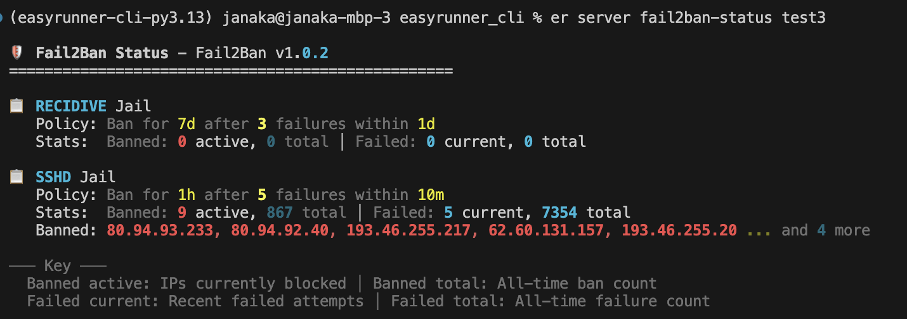

Progress update for Nov 2025. Intrusion prevention, DNS auto setup and more.
<!-- more -->
Solid progress this month with some useful features landing. CI/CD gremlins for EasyRunner itself ate more time than I'd have liked, but we pushed through.

- **Intrusion prevention with Fail2Ban** — EasyRunner now installs and configures Fail2Ban with a basic policy, giving your server an extra layer of protection out of the box. I'll be working on iterating the policies to provide a decent level of protection out of the box.
`er server fail2ban-status <server_name>`

- **CloudFlare link** — Connect your CloudFlare account by providing an API token. This powers the DNS auto-setup feature below. Your token is stored securely in your computer's keyring and requires authentication each time EasyRunner accesses it. You control the token's scopes, so you decide the blast radius.

- **CloudFlare DNS record auto-setup** — When you add a new app to a server, EasyRunner automatically finds the domain in CloudFlare and creates the DNS record for you. Update the app's DNS settings in EasyRunner and the CloudFlare record updates too.

- **Improved deploy UX** — The deploy command now shows real-time activity and progress. Commands like `er server create` and `er server init` will get the same treatment soon.

- **Service layer refactor** — Business logic has moved from the CLI into a core library service layer. This paves the way for other interfaces like a web app down the line.

- **CLI publishing improvements** — Homebrew publishing has been streamlined and several versioning bugs squashed. You can now install previous versions if needed.

- **Alpha testing is open** If you'd like to get involved, drop me a line at [janaka@easyrunner.xyz](mailto:janaka@easyrunner.xyz).
