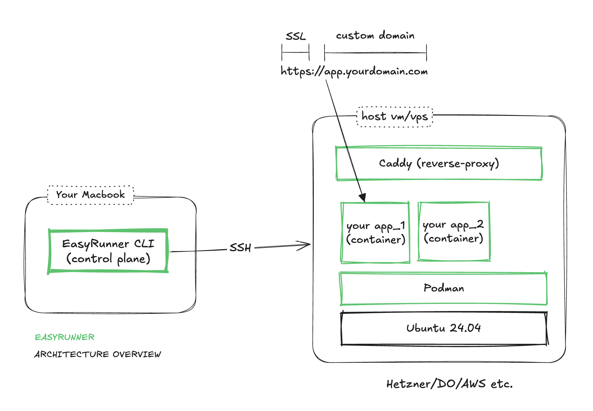
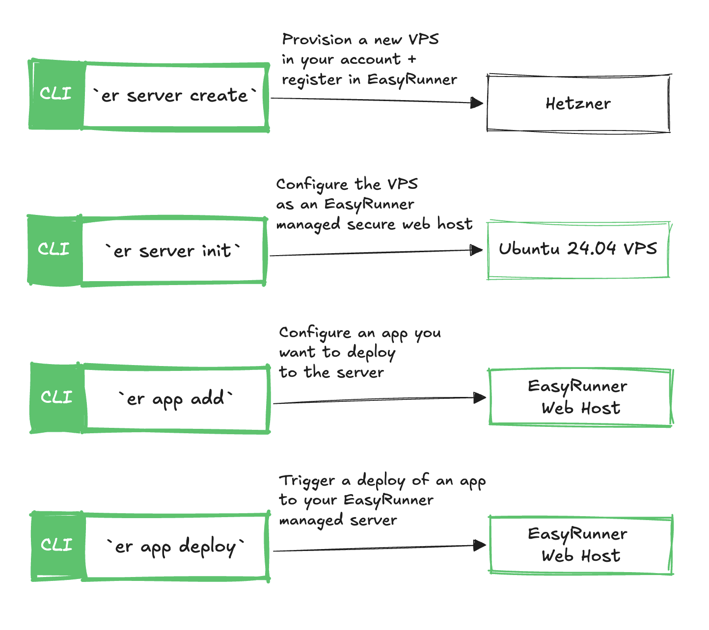
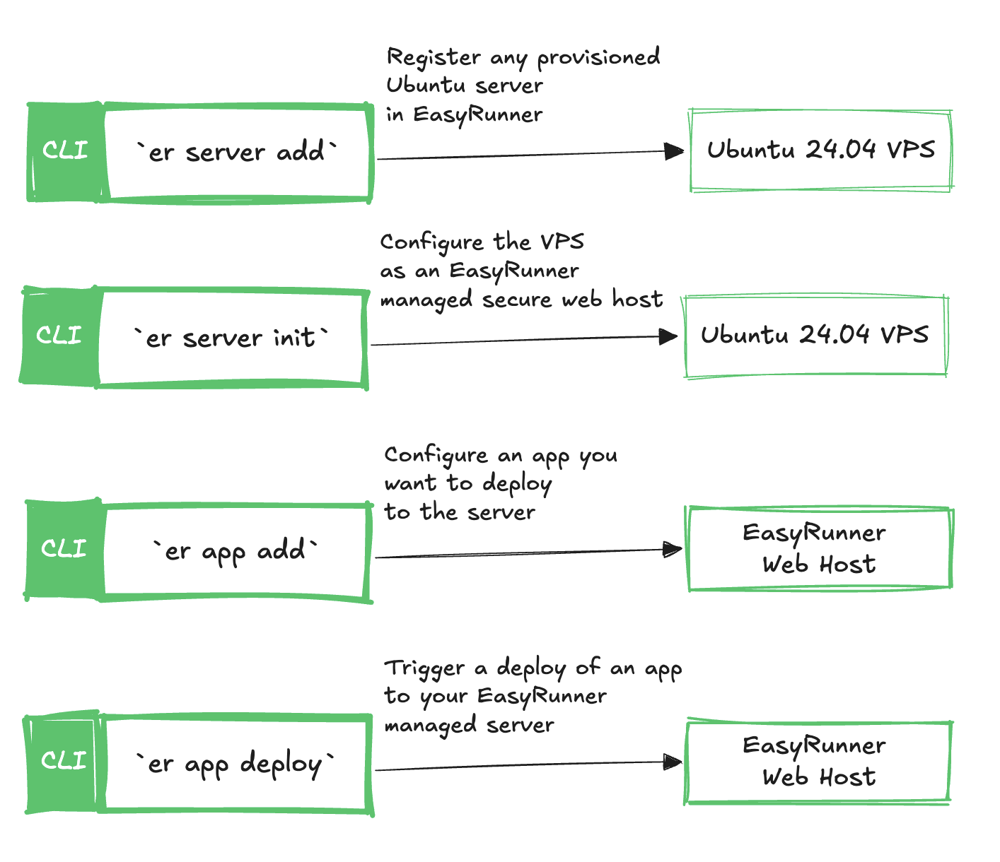

# How It Works

1. You provide an Ubuntu 24.04 server (cloud VM, VPS, or bare metal).
2. Install the EasyRunner CLI on your laptop.
3. EasyRunner configures the server and deploys your app securely.

!!! Note

    EasyRunner is still an alpha version, meaning it's being rapidly developed therefore unstable.

## Read More

[Why Behind EasyRunner](https://janaka.dev/side-project-intro-easyrunner/)

[EasyRunner Secure Network Architecture](./blog/posts/easyrunner-secure-network-architecture.md)

## Architecture Overview

## Provision a Hetzner Server and Deploy Your App

## Bring-You-Own-Server and Deploy Your App

