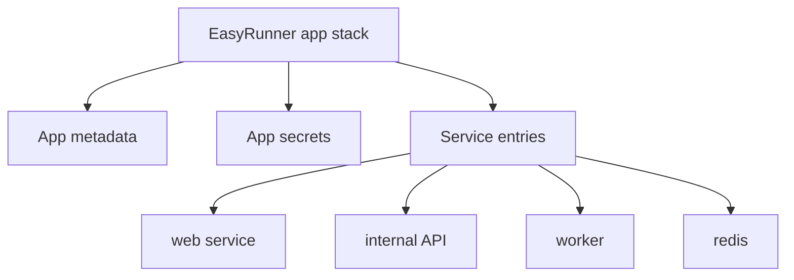

# Apps and Services

EasyRunner uses **app** for the deployable thing you operate. The Compose file format uses **service** for each container/process inside that app.

!!! note "Compose means the file format"
    EasyRunner reads Compose-format YAML, then converts it into Podman/systemd configuration. These docs use **Compose** as shorthand for the Docker Compose file format, not the Docker Compose CLI tool.

## The Model



An EasyRunner app can be one public web service, or it can be a small stack of services that work together.

## One-Service App

```text
app: docs-site
└── service: web
```

This is the common first deployment. The service listens on an internal port, and Caddy routes public HTTPS traffic to it.

## Multi-Service App

```text
app: customer-portal
├── service: web       public
├── service: api       internal
├── service: worker    internal
└── service: redis     internal
```

Only the service you mark as public should receive external traffic. Internal services remain on the app network.

=== "EasyRunner term"

    **App** is the lifecycle unit. You add, deploy, inspect, start, stop, restart, and remove it with `er app ...`.

=== "Compose-format term"

    **Service** is a process/container inside the app. Services are declared under `services:` in the Compose-format file.

=== "Routing term"

    **Public service** means Caddy can route HTTPS traffic to it. Internal services remain on the app network.

## Compose-Format Labels

EasyRunner reads labels on service entries to understand how to route and run them.

Current labels use `app...` names even though they are applied at the service level:

```yaml
labels:
  xyz.easyrunner.appNodeType: web # (1)!
  xyz.easyrunner.appFramework: standardbackend
  xyz.easyrunner.appContainerInternalPort: "3000" # (2)!
```

1. Service role. `web` means this service can receive public traffic through Caddy.
2. Internal container port Caddy should proxy to.

!!! note "Current naming"
    Treat these labels as service-level configuration. The product may introduce clearer `service.*` labels in the future, but the current labels are the supported public interface today.

See [Compose-Format Files and Labels](../reference/compose-labels.md) for the reference.
