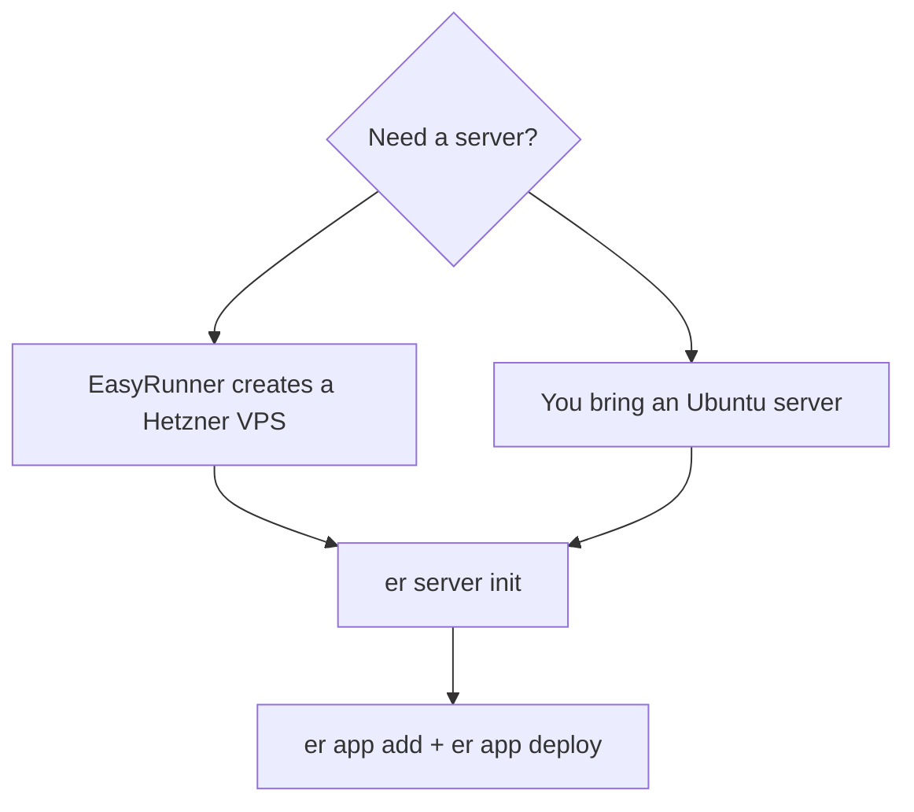

# Server Provisioning Paths

EasyRunner separates **getting a server** from **initializing it as a web host**.



## The Two Paths

=== "Let EasyRunner create one"

    Use this path when you want EasyRunner to create a Hetzner Cloud VPS and register it.

    ```bash
    er link hetzner default --api-key <hetzner-api-token>  # (1)!
    er server create my-server hetzner                     # (2)!
    er server init my-server --username root                # (3)!
    ```

    1. Stores the Hetzner project credential.
    2. Creates and registers the server.
    3. Installs and configures the web-host stack.

    EasyRunner handles the cloud-provider provisioning step, then the server joins the same web-host lifecycle as any other server.

=== "Bring an existing server"

    Use this path when you already have an Ubuntu server from Hetzner, DigitalOcean, Azure, AWS, GCP, a homelab, or another provider.

    ```bash
    er server add my-server <server-ip>       # (1)!
    er server show-ssh-key my-server          # (2)!
    er server init my-server --username root  # (3)!
    ```

    1. Registers the server and creates an EasyRunner SSH key.
    2. Prints the public key you need to authorize on the server.
    3. Installs and configures the web-host stack.

    You create the VPS/VM and authorize EasyRunner's generated SSH key. EasyRunner then initializes it like any other web host.

## What Initialization Does

`er server init` turns the Ubuntu machine into an EasyRunner web host. It installs and configures the hosting stack, including Podman for containers, Caddy for HTTPS routing, server users, firewall rules, and supporting systemd behavior.

!!! tip "The convergence matters"
    EasyRunner-created servers and manually provisioned servers are not two separate product worlds. They are two ways to get an Ubuntu machine into EasyRunner. After `er server init`, app deployment works the same way.

## Choosing a Path

| Choose this | When |
| --- | --- |
| EasyRunner-provisioned Hetzner server | You want the fastest path and are happy to use Hetzner Cloud. |
| Existing Ubuntu server | You already have infrastructure, want a different provider, or want to control provisioning manually. |

??? abstract "Product model"
    Provisioning answers "where does the machine come from?" Initialization answers "is this machine ready to host apps with EasyRunner?" Keeping those ideas separate makes it easier to switch providers later.
