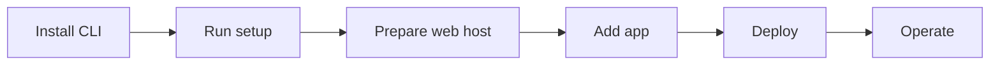

# EasyRunner CLI Docs

EasyRunner is a CLI-first way to turn your own Ubuntu server into a secure web host for containerized apps. These docs are organized around the model you need to understand, then the tasks you need to complete.

<div class="grid cards" markdown>

-   #### :material-map-search: Concepts

    ---

    Learn the shape of EasyRunner: control plane, web host, app, service, deploy flow, link, and mesh.

    [Start with concepts](concepts/index.md)

-   #### :material-rocket-launch: Quickstart

    ---

    Install the CLI, prepare a server, and deploy your first app over HTTPS.

    [Deploy your first app](quickstart/first-app.md)

-   #### :material-tune: Setup

    ---

    Install EasyRunner, run first-time setup, install a license, and link external services.

    [Prepare the CLI](setup/install.md)

-   #### :material-server: Servers

    ---

    Create a Hetzner server with EasyRunner or bring an existing Ubuntu server.

    [Set up a web host](servers/create-hetzner-server.md)

-   #### :material-application-braces: Apps

    ---

    Add apps, configure Compose-format files, choose a deploy flow, manage secrets, and operate deployments.

    [Deploy apps](apps/add-app.md)

-   #### :material-bookshelf: Reference

    ---

    Command reference, Compose-format labels, and troubleshooting notes for when something needs a closer look.

    [Use the reference](reference/commands.md)

</div>

## The Short Version



The main split happens when you prepare a web host:

```text
Need a server?
├── Let EasyRunner create one on Hetzner
│   └── er link hetzner ... + er server create <name> hetzner
└── Bring an existing Ubuntu server
    └── er server add <name> <ip> + authorize the generated SSH key

Both paths converge at:
└── er server init <name> --username <user>
```

!!! tip "New to EasyRunner?"
    Read [EasyRunner in One Page](concepts/index.md), then follow [Deploy Your First App](quickstart/first-app.md). That gives you the concepts and the practical path without making you read every reference page first.

## Pick Your Path

=== "Fastest first deploy"

    Use this path when you want EasyRunner to create the server on Hetzner and you want to build your app from source on the web host.

    1. [Install the CLI](setup/install.md)
    2. [Run first-time setup](setup/first-run-setup.md)
    3. [Create a Hetzner server](servers/create-hetzner-server.md)
    4. [Deploy your first app](quickstart/first-app.md)

=== "Bring your own server"

    Use this path when you already have an Ubuntu server from any provider.

    1. [Install the CLI](setup/install.md)
    2. [Add an existing server](servers/add-existing-server.md)
    3. [Initialize the web host](servers/initialize.md)
    4. [Add an app](apps/add-app.md)

=== "CI-built images"

    Use this path when your pipeline already pushes container images to a registry.

    1. [Understand deploy flows](concepts/deploy-flows.md)
    2. [Configure Flow B](apps/flow-b.md)
    3. [Manage registry secrets](apps/secrets.md)
    4. [Operate the app](apps/operations.md)
